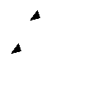
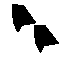

# Evaluating Same-Different Models
This simple codebase allows you to load a fine-tuned model from the paper [Deep Neural Networks Can Learn Generalizable Same-Different Visual Relations](https://arxiv.org/abs/2310.09612) by Tartaglini et al. (2023). 

## Getting started
Begin by cloning this repo onto your local machine. Navigate to the directory where you would like this codebase to be installed and run: 
```
git clone https://github.com/alexatartaglini/same-different-eval.git
```
Next, make sure that you've installed all required Python packages. Create a new virtual environment, activate the environment, and run:
```
pip install -r requirements.txt
```

## Adding an evaluation dataset
Evaluation datasets are stored in the directory `datasets`. This repo comes with a default same-different evaluation dataset named "filled", which demonstrates how evaluation datasets should be formatted. This dataset contains images like the following:

<div align="center">
  
| "Same": |  |  |  |
|-|-|-|-|
| **"Different":** |  |  |  |

</div>


